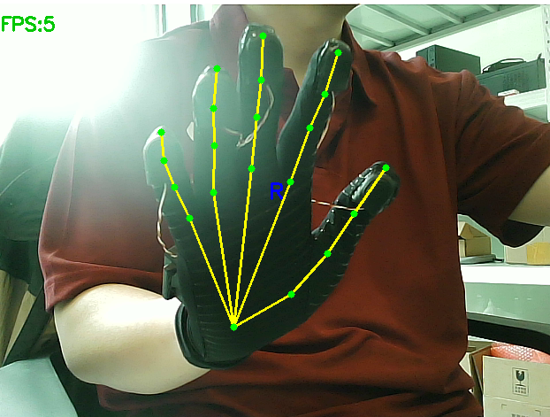

# HAMER - Real-time Hand Mesh Recovery

Real-time 3D hand pose estimation using [HAMER](https://github.com/geopavlakos/hamer) with ViTPose hand detection, deployed on Windows local machine.



---

## Pipeline
```
Camera (640x480) → ViTPose (hand detection, every 6 frames)
                                      ↓
                              Bbox tracking (intermediate frames)
                                      ↓
                    ViTDetDataset (crop + normalize to 256x256)
                                      ↓
                        HAMER (3D hand mesh reconstruction)
                                      ↓
                   2D keypoint projection + skeleton overlay
                                      ↓
                              Display (q/ESC to quit)
```

## Requirements

| Component | Details |
|-----------|---------|
| GPU | NVIDIA RTX 4080 Laptop (12GB VRAM) |
| CUDA | 12.8, Python 3.10, PyTorch 2.6.0+cu124 |
| Conda | `hamer` environment |

### Model Files (D:\hamer_data\_DATA\)
| File | Size | Source |
|------|------|--------|
| hamer.ckpt | 2.5 GB | HAMER pretrained checkpoint |
| wholebody.pth | 3.8 GB | ViTPose whole-body model |
| MANO_RIGHT.pkl | 3.8 MB | MANO hand model |

## Installation

```bash
# 1. Create conda environment
conda create --name hamer python=3.10
conda activate hamer

# 2. Install PyTorch
pip install torch torchvision torchaudio --index-url https://download.pytorch.org/whl/cu124

# 3. Install dependencies
pip install smplx timm pytorch_lightning einops scipy opencv-python
pip install trimesh pyrender yacs scikit-image mediapipe pillow
pip install mmpose mmdet webdataset gdown

# 4. Download and install HAMER
git clone --recursive https://github.com/geopavlakos/hamer.git
cd hamer && pip install -e .

# 5. Download demo data (checkpoint + MANO + ViTPose)
bash download_hamer_data.sh  # or use download_hamer_data.py
```

## Usage

```bash
# Run real-time camera inference
python run_hamer_camera.py

# Run accuracy test (capture annotated frames)
python test_accuracy.py

# Measure pipeline latency
python measure_latency.py
```

## Latency Analysis

| Stage | Time | Notes |
|-------|------|-------|
| Camera capture | ~66ms | 640x480 @ 15 FPS |
| ViTPose inference | ~112ms | Every 6 frames (effective ~19ms/frame) |
| HAMER inference | ~50ms | Per hand, every frame |
| **Full pipeline** | **~135ms** | Effective **7.4 FPS** |

### Optimizations Applied
- **Frame skipping**: ViTPose runs only every 6 frames; intermediate frames reuse last known hand positions
- **Wrist disambiguation**: When ViTPose assigns both left/right to the same hand, wrist keypoint confidence determines the correct label
- **No OpenGL rendering**: 2D skeleton projection via affine transform avoids pyrender/OpenGL issues on Windows

## Key Files

| File | Purpose |
|------|---------|
| run_hamer_camera.py | Main real-time pipeline (ViTPose + HAMER) |
| test_accuracy.py | Capture test frames with annotations |
| test_hamer.py | Verify HAMER model loading and inference |
| test_vitpose.py | Verify ViTPose model loading |
| download_hamer_data.py | Download model weights from Google Drive |
| measure_latency.py | Per-stage latency measurement |
| WORK_LOG.md | Full deployment log, architecture, tuning notes |

## Known Issues

- ViTPose sometimes assigns both "left" and "right" hand keypoints to the same physical hand when only one hand is visible → partially mitigated by wrist-based disambiguation
- OpenGL/pyrender not supported on Windows → 2D skeleton overlay used instead of 3D mesh rendering
- Google Drive download is slow from China → use VPN or proxy

## Credits

- [HAMER](https://github.com/geopavlakos/hamer) - Hand Mesh Recovery (G. Pavlakos et al., CVPR 2024)
- [ViTPose](https://github.com/ViTAE-Transformer/ViTPose) - Vision Transformer Pose Estimation
- [MediaPipe](https://mediapipe.dev) - Hand landmark detection (alternative pipeline)
